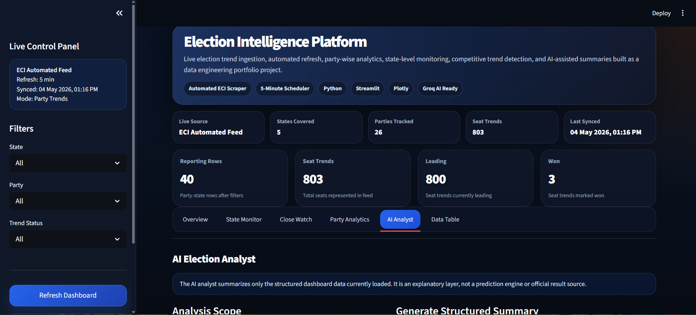
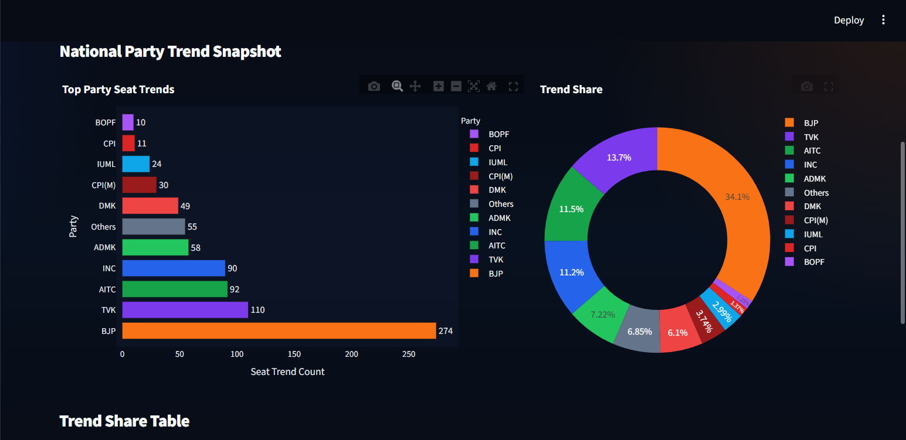
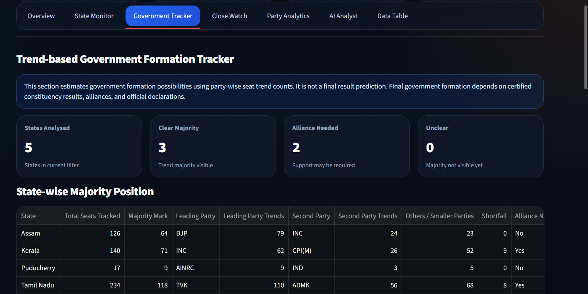
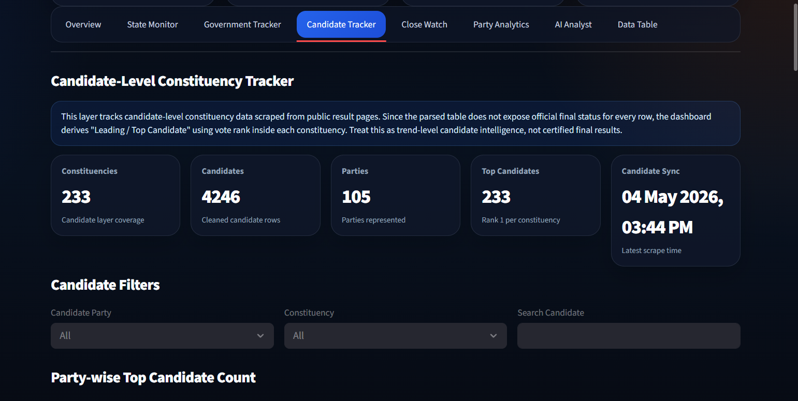
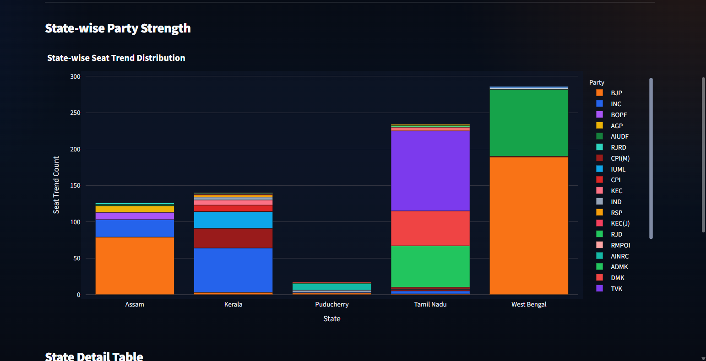
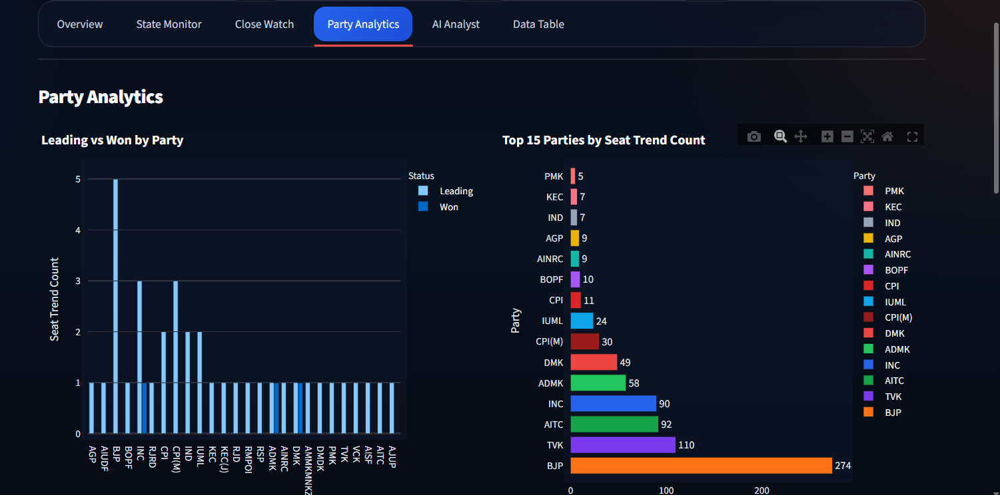
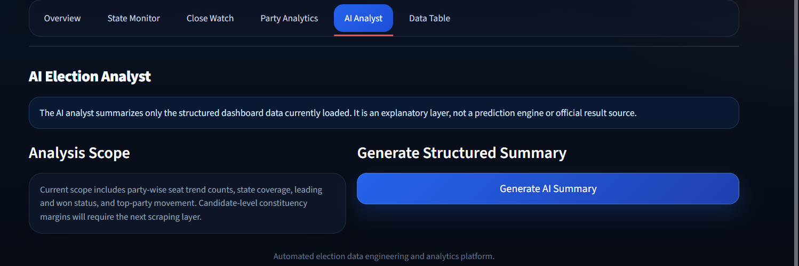
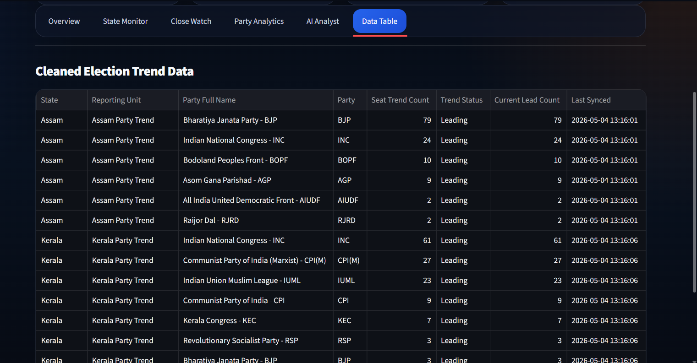

# Election Intelligence Platform

A real-time election analytics dashboard built as a data engineering, analytics, and AI portfolio project.

The project ingests live party-wise election trend data, cleans and transforms it into an analytics-ready dataset, and displays interactive insights through a Streamlit dashboard.

## Project Objective

Election result data is frequently refreshed, scattered across public result pages, and difficult to monitor manually. This project builds an automated election intelligence layer that tracks live trends, party momentum, state-level performance, close contests, candidate-level constituency patterns, and AI-assisted summaries.

## Key Features

- Automated election trend ingestion from public result pages
- Scheduled party-level refresh every 5 minutes
- Cleaned analytics-ready CSV pipeline
- Interactive Streamlit dashboard
- State-wise party monitoring
- Party-wise leading and won trend analysis
- Trend-based government formation tracker
- Candidate-level constituency tracking
- Leading candidate detection using vote-rank logic
- Closest candidate margin monitoring
- Party-wise top candidate count
- Searchable candidate and constituency-level data table
- Close contest tracker
- Margin distribution analysis
- Raw cleaned data explorer
- Groq AI-ready summary module
- Portfolio-ready data engineering architecture
- Resumable candidate scraper with progress logging

## Tech Stack

- Python
- Streamlit
- Pandas
- Plotly
- BeautifulSoup
- Playwright
- Groq API
- PowerShell scheduler
- CSV-based lightweight data pipeline
- GitHub
- Streamlit Cloud

## Project Architecture

```text
ECI Result Pages
        ↓
Playwright / Scraper
        ↓
Raw Data Layer
        ↓
Cleaning + Transformation
        ↓
Processed CSV Layer
        ↓
Streamlit Dashboard
        ↓
AI Summary Layer
```

## Data Pipeline Design

The project uses two separate data layers.

### 1. Fast Party Trend Layer

```text
ECI Party Result Pages
        ↓
eci_party_auto_ingest.py
        ↓
data/processed/latest_results.csv
        ↓
Streamlit Dashboard
```

Purpose:

- Overview dashboard
- State monitor
- Party analytics
- Government tracker
- AI summary layer

Refresh policy:

```text
Every 5 minutes locally through scheduler.py
```

### 2. Candidate-Level Constituency Layer

```text
ECI Constituency Pages
        ↓
eci_candidate_auto_ingest_v2.py
        ↓
Partial raw candidate file
        ↓
Cleaned candidate dataset
        ↓
data/processed/latest_candidate_results.csv
        ↓
Candidate Tracker tab
```

Purpose:

- Candidate tracker
- Top candidate detection
- Closest candidate margin tracking
- Constituency-level exploration
- Party-wise top candidate count

Refresh policy:

```text
Batch/manual refresh
```

Candidate-level scraping is slower because it opens each constituency page separately. Therefore, party-level data is refreshed frequently, while candidate-level data is refreshed in slower batches.

## Dashboard Preview

### Overview



### State Monitor



### Government Tracker



### Candidate Tracker



### Close Watch



### Party Analytics



### AI Analyst



### Data Table



## Folder Structure

```text
live-election-intelligence-platform/
│
├── app.py
├── scheduler.py
├── eci_party_auto_ingest.py
├── eci_candidate_auto_ingest.py
├── eci_candidate_auto_ingest_v2.py
├── ai_insights.py
├── transform.py
├── requirements.txt
├── README.md
├── .gitignore
│
├── data/
│   ├── sample/
│   └── processed/
│       ├── latest_results.csv
│       └── latest_candidate_results.csv
│
├── screenshots/
├── docs/
├── src/
│   ├── ai/
│   ├── pipelines/
│   ├── scraper/
│   └── utils/
```

## How to Run Locally

### 1. Create virtual environment

```bash
python -m venv venv
```

### 2. Activate virtual environment

```bash
venv\Scripts\activate
```

### 3. Install dependencies

```bash
pip install -r requirements.txt
playwright install
```

### 4. Run party-level ingestion once

```bash
python eci_party_auto_ingest.py
```

### 5. Start the party-level scheduler

```bash
python scheduler.py
```

The scheduler refreshes the party-level dataset every 5 minutes.

```python
REFRESH_SECONDS = 300
```

### 6. Run candidate-level scraper

For a test run:

```bash
python eci_candidate_auto_ingest_v2.py --visible --fresh --max 10
```

For a resume test:

```bash
python eci_candidate_auto_ingest_v2.py --visible --max 10
```

For a full candidate-level run:

```bash
python eci_candidate_auto_ingest_v2.py --visible
```

To rebuild the final processed candidate dataset from partial raw data:

```bash
python eci_candidate_auto_ingest_v2.py --rebuild-only
```

### 7. Start the dashboard

Open a second terminal and run:

```bash
streamlit run app.py
```

Then open:

```text
http://localhost:8501
```

## Dashboard Sections

### Overview

Shows national party trend snapshot, seat trends, leading count, won count, states covered, parties tracked, and latest synced time.

### State Monitor

Tracks party-wise trend performance across states.

### Government Tracker

Estimates trend-based government formation possibilities using party-wise seat trend counts, majority marks, leading parties, alliance requirement, and shortfall analysis.

### Candidate Tracker

Tracks candidate-level constituency data scraped from public result pages. Since official status is not available in every parsed row, the dashboard derives the top candidate using vote rank within each constituency.

It includes:

- Party-wise top candidate count
- Closest candidate margins
- Top candidates by votes
- Candidate search
- Constituency filters
- Full candidate-level data exploration

### Close Watch

Highlights competitive party trends based on low-volume party trend counts.

### Party Analytics

Compares leading vs won values and shows party-wise trend strength.

### AI Analyst

Generates structured summaries from dashboard data using Groq.

### Data Table

Displays the cleaned processed dataset used by the dashboard.

## Automation

The project includes two automation layers.

### Party-Level Scheduler

File:

```text
scheduler.py
```

Refresh interval:

```python
REFRESH_SECONDS = 300
```

This scheduler runs separately from the Streamlit dashboard and refreshes:

```text
data/processed/latest_results.csv
```

### Resumable Candidate Scraper

File:

```text
eci_candidate_auto_ingest_v2.py
```

This scraper improves reliability by:

- Saving progress after every constituency
- Maintaining a scrape log
- Maintaining a failed constituency log
- Supporting resume mode
- Supporting fresh runs
- Supporting batch limits for testing
- Rebuilding the final processed candidate dataset from partial raw data

Candidate-level scraping is intentionally not refreshed every 5 minutes because it is heavier and opens constituency-level pages one by one.

## Candidate Status Logic

The parsed candidate tables do not expose official final status consistently.

Therefore, the dashboard derives candidate position using vote rank within each constituency:

```text
Rank 1  -> Leading / Top Candidate
Rank 2  -> Runner-up
Rank 3+ -> Trailing
```

This is trend-level intelligence, not certified final election result declaration.

## Important Note

This dashboard tracks live trend counts from public election result pages. These are not final certified election results. Final results should always be verified from official ECI statistical reports.

Candidate-level status is derived using vote ranking because the parsed ECI candidate tables do not expose official final status consistently. Rank 1 is treated as "Leading / Top Candidate" for trend intelligence, not as a certified winner.

## Portfolio Value

This project demonstrates:

- Public data ingestion
- Web scraping
- Automated refresh scheduling
- Data cleaning
- Analytics-ready pipeline design
- Dashboard development
- Interactive visual analytics
- Candidate-level constituency analytics
- AI-assisted reporting
- Real-time public data monitoring
- Resume-safe scraper design
- Production-style data pipeline thinking

## Current Limitations

- Candidate-level scraping is slower than party-level scraping because each constituency page is opened separately.
- Streamlit Cloud displays the committed processed CSV files; it does not continuously run the local scheduler.
- Candidate winner status is derived from vote rank, not official certified winner declarations.
- Cloud automation can be improved later with Azure VM, GitHub Actions, Azure Blob Storage, or a cloud database.

## Future Improvements

- Constituency-level certified winner tracking
- CM candidate tracker
- Previous CM candidate tracker
- Government formation tracker using candidate-level declared winners
- Alliance mapping logic
- Historical trend comparison
- Azure-hosted automated refresh pipeline
- Cloud database integration
- Faster parallel candidate scraping with safe throttling
- State-wise scraper batching